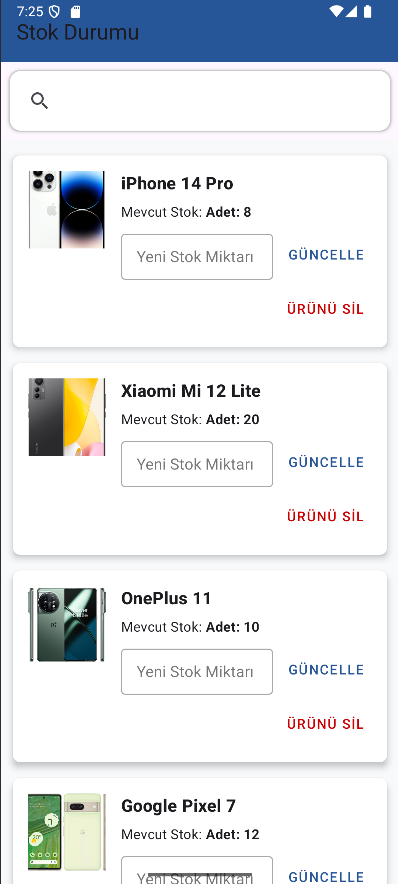
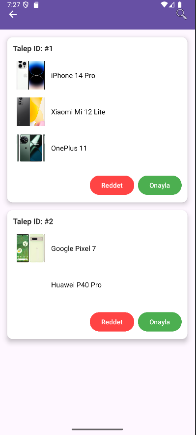

# Mobil Bayii

## 📌 Proje Özeti

Mobil Bayii, Android Studio kullanılarak geliştirilen ve SQLite veritabanı ile desteklenen bir bayi yönetim uygulamasıdır. Proje, bir ürün satış ağı içerisinde bayi, müşteri, ürün ve sipariş süreçlerini dijital ortamda takip edebilmeyi amaçlar. Uygulama içerisinde yöneticiler ürünleri sisteme ekleyebilir, müşteriler sipariş oluşturabilir ve bu siparişler yönetim paneli üzerinden onaylanabilir.

## ⚙️ Geliştirme Ortamı

* **IDE:** Android Studio Hedgehog | Arctic Fox
* **Dil:** Kotlin
* **Veritabanı:** SQLite
* **Min SDK:** 28 (Android 9.0)
* **Emülatör/Test Cihazı:** Android API 28 veya üzeri
* **Versiyon Kontrol:** Git & GitHub

## 🗃️ Veritabanı Yapısı

Proje kapsamında kullanılan başlıca tablolar:

* `admin` - Sistem yöneticileri
* `customers` - Kayıtlı müşteriler
* `products` - Ürün bilgileri
* `orders` - Sipariş kayıtları
* `requests` - Müşteri tarafından oluşturulan sipariş istekleri
* `product_images` - Ürün görselleri
* `stocks` - Bayiye özel stok bilgileri
* `request_items` - Sipariş isteklerinde yer alan ürünler
* `deleted_log` - Silinen kayıtların açıklamalarının ve zamanlarının tutulduğu log tablosu

İlişkiler, yabancı anahtarlar (foreign key) aracılığıyla kurulmuş ve veritabanı 3NF-5NF arasında normalleştirilmiştir. Gereksiz veri tekrarları ve transitif bağımlılıklar ortadan kaldırılmıştır. Index, view ve trigger kullanımı sağlanmıştır.

## 🔧 Kurulum ve Çalıştırma

1. Bu repoyu klonlayın:

   ```bash
   git clone https://github.com/mezoxy-dev/mobil-bayii.git
   ```

2. Android Studio ile projeyi açın:

   * `File > Open > mobil-bayii` dizinini seçin.

3. Emulator veya fiziksel bir cihazda uygulamayı çalıştırın:

   * `Run > Run 'app'` veya Shift+F10

4. SQLite veritabanı uygulama içinde gömülüdür ve ilk çalıştırmada oluşturulur.

## 🗈️ Arayüzden Görüntüler

| Ana Ekran                              | Stok Listesi                             | Talepler Sayfası                       |
| -------------------------------------- | ---------------------------------------- | -------------------------------------- |
|     |     | |

## 📁 Proje Dosyaları

* `app/` – Android uygulama kaynak kodları
* `mobilbayii.db` – Örnek SQLite veritabanı
* `grupno_sql_betikleri.txt` – SQL betikleri
* `grupno_kaynakkod.txt` – Tüm kaynak kodların düz metin hali
* `grupno_rapor.pdf` – IEEE formatlı proje raporu
* `grupno_github.txt` – GitHub link bilgisi

## 📍 Notlar

* Kodlar açıklama satırları ile belgelenmiştir.
* Trigger, view ve index içeren örnek SQL betikleri `sql/` klasöründe yer almaktadır.
* Proje raporu ve tüm istenen çıktı formatları repo içerisinde paylaşılmıştır.

## 📚 Kaynaklar

* [SQLite Documentation](https://www.sqlite.org/docs.html)
* [Android Developer Guide](https://developer.android.com/)
* [Kotlin Language Reference](https://kotlinlang.org/docs/home.html)

---

© 2025 – Kocaeli Üniversitesi Bilişim Sistemleri Mühendisliği – VTYS Dönem Projesi
